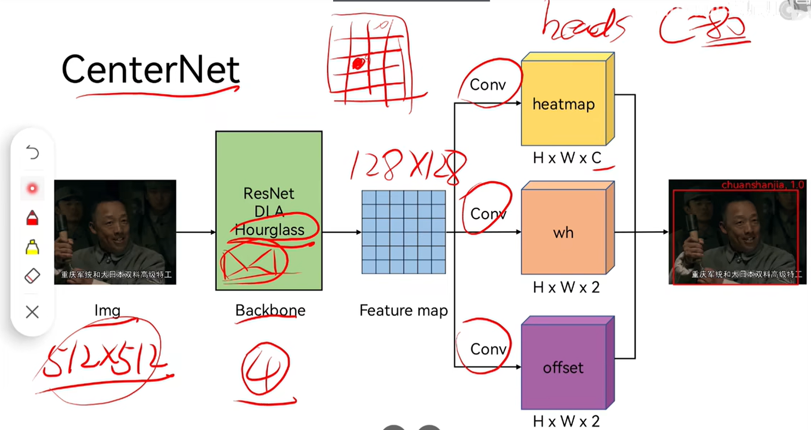

#  [CenterNet](https://arxiv.org/abs/1904.07850)

[B站讲解视频1](https://www.bilibili.com/video/BV1r44y1a75j/?spm_id_from=333.337.search-card.all.click&vd_source=42f1e486842e9add1356fbbd0f4159f3)

[B站讲解视频2，本项目中采用的代码基于此视频](https://www.bilibili.com/video/BV1mK411u77S/?spm_id_from=333.337.search-card.all.click&vd_source=42f1e486842e9add1356fbbd0f4159f3)


## 1. Network
 - Backbone: [ResNet](), [Hourglass](), [Deep Layer Aggregation]()
 - [Decoder](): UpSample + BN + Activation作为一个block，以此堆叠三次作为一个Decoder。其中CenterNet的UpSample为反卷积，激活函数为ReLU。需要注意的是，三个反卷积的核大小都为4x4，卷积核的数目分别为256，128，64。那么经过Decoder之后，feature map的宽高维度则变为原来1/4（比较重要，后面会反复用到），通道维度为64。

 - Head:


## 2 Loss function
- CIOU（Complete Intersection over Union）
## 3 Annotation

## 4 [Code](https://github.com/bubbliiiing/centernet-pytorch)
### 4.1 Environment setup (x86)
- Docker pull
    - ` $ sudo docker pull nvidia/cuda:11.4.3-cudnn8-devel-ubuntu20.04`
- 启动镜像
    - `$ sudo docker run --name torch1.13.1 -itd  -v /home/ntueee/yangjianbing:/root/code -p 2002:22   -e NVIDIA_DRIVER_CAPABILITIES=compute,utility --gpus all --shm-size="12g" --restart=always nvidia/cuda:11.4.3-cudnn8-devel-ubuntu20.04`
- Install ssh (Note that enter container first!)
    - `$ apt-get update`
    - `$ apt-get install vim`
    - `$ apt-get install openssh-server`
    - 设置root密码，后续登录会用到: `$ passwd`
    - 修改配置文件: `$ vim /etc/ssh/sshd_config`
        ``` 
        #PermitRootLogin prohibit-password
        PermitRootLogin yes
        UsePAM yes 修改为 no
        注释这一行PermitRootLogin prohibit-password
        添加一行PermitRootLogin yes
        UsePAM yes 修改为 no #禁用PAM
        ```
    - 重启ssh服务: `$ service ssh restart`
    - 添加开机启动
        - 新建`power_launch.sh`文件，放到根目录：`/root`下，`power_launch.sh`添加如下内容
            ```
            #!/bin/sh -e
            service ssh start &
            ```
        - 获取读写权限：`chmod 777 /root/power_launch.sh`
        - 编辑`~/.bashrc`: `vim ~/.bashrc`，在下面添加
            ```
            if [ -f /root/power_launch.sh ]; then
                    ./root/power_launch.sh
            fi
            ```
- Install pytorch 1.13
    - 创建python软链接：`$ ln -s /usr/bin/python3 /usr/bin/python`
    - install pip package: `apt-get install pip`
    - 下载[cu116/torch-1.13.0%2Bcu116-cp38-cp38-linux_x86_64.whl](https://download.pytorch.org/whl/cu116/torch-1.13.0%2Bcu116-cp38-cp38-linux_x86_64.whl)，安装：`pip install torch-1.13.0+cu116-cp38-cp38-linux_x86_64.whl`
    - 下载[cu116/torchvision-0.14.0%2Bcu116-cp38-cp38-linux_x86_64.whl](https://download.pytorch.org/whl/cu116/torchvision-0.14.0%2Bcu116-cp38-cp38-linux_x86_64.whl)，安装：`pip install torchvision-0.14.0+cu116-cp38-cp38-linux_x86_64.whl`
    - 测试是否用的GPU：
        ```
        import torch
        flag = torch.cuda.is_available()
        if flag:
            print("CUDA is available")
        else:
            print("CUDA is not available")
        ```
- Install COCO API
    - pip install Cython
    - pip install pycocotools==2.0.0

- Install dependence
    - apt update && apt install -y libsm6 libxext6
    - apt-get install -y libxrender-dev
    - cd 01-ObjectDetection/CenterNet/code
    - pip install -r requirements.txt
### 4.2 Train (x86)
- 制作训练标签 (`.txt` file)
    ```
    1、训练标签
    每行：image_path x_min,y_min,x_max,y_max,cls x_min,y_min,x_max,y_max,cls ... (注意：类别标签从0开始，如果有10个类，则类别为 0, 1, 2, 3, 4, 5, 6, 7, 8, 9)

    For example (train.txt): 
    /dir/000014.jpg 72,163,302,228,5 185,194,500,316,6 416,180,500,222,6 314,8,344,65,14 331,4,361,61,14 357,8,401,61,0
    /dir/000015.jpg 77,136,360,358,1

    2、类别标签 (`.txt` file)，如果是10个类
    cls0
    cls1
    cls2
    cls3
    cls4
    cls5
    cls6
    cls7
    cls8
    cls9

    For example (class.txt):
    aerop
    bicyc
    bird
    boat
    bottl
    bus
    car
    cat
    chair
    cow
    ```
- COCO格式的训练标签生成，在`code/generate_train_label`目录下找到[coco_annotation.py](code/generate_train_label/coco_annotation.py)，指令如下：
    ```
    python coco_annotation.py --ann_dir coco标签的存储路径 --ann_name coco标签的名称 --label_save_dir 生成训练标签的存储路径 --label_save_name 生成训练标签的存储名称 --class_names 生成coco中类别文件的存储名称 --images_dir 训练图像的存储目录
    
    For example:
    python coco_annotation.py --ann_dir /root/code/dataset/annotations --ann_name instances_train2017.json --label_save_dir /root/code/dataset/annotations --label_save_name instances_train2017.txt --class_names coco_classes.txt --images_dir /root/code/dataset/train2017
    ```

- 训练
    - 在`code`目录下新建`model_data`和`logs`文件夹：`mkdir model_data`, `mkdir logs` 
    - 将`预训练模型`拷贝到`model_data`
    - 在`code`目录下找到`train.py`文件，修改相关参数：
        ```
        classes_path = "第一步‘制作训练标签’中的‘类别标签’路径"
        model_path = "预训练模型路径"
        train_annotation_path = "第一步‘制作训练标签’中的‘训练标签’路径"
        val_annotation_path = "第一步‘制作训练标签’中的‘训练标签’路径"
        ```
    - `cd code`
    - `python train.py`
### 4.3 Forward 
- (x86)
    - 在`code`目录下找到`centernet.py`，修改相关参数：
        ```
        "model_path": "模型路径"
        "classes_path": "第一步‘制作训练标签’中的‘类别标签’路径"
        ```
    - 在`code`目录下找到`predict.py`，修改相关参数：
        ```
        将mode设置为predict
        mode = "predict"
        ```
    - `cd code`
    - `python predict.py`
    - 预测成功后，会在`img_out`目录下生成`results.jpg`
- arm

### 4.4 Estimation

### 4.5 convert to onnx

### 4.6 onnx convert to trt
